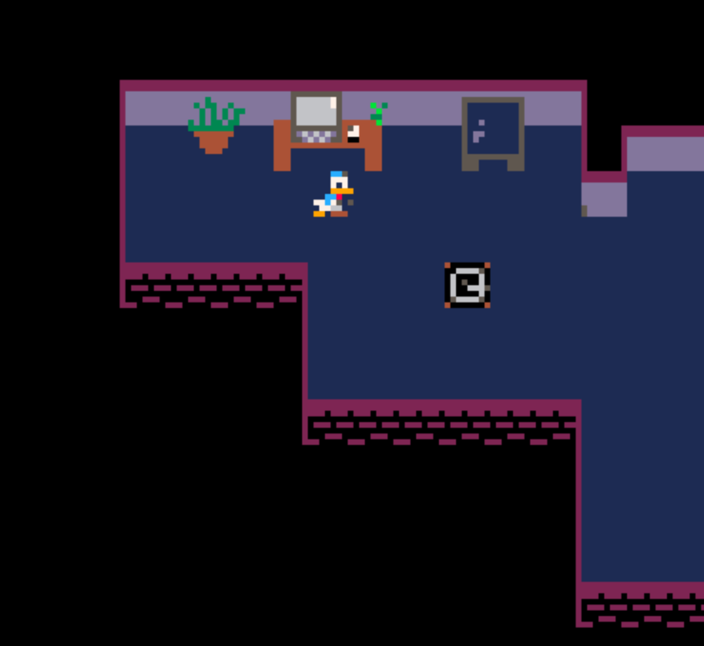

BiSH's Bots- Team: Miranda Bishard
# Study Story 

* [Problem_Statements](problem.md)
* [User_Stories](userstories.md)
* [Requirements](requirements.md)
* [Architecture](architecture.md)
* [Design_Doc](design.md)
* [Test_Report](testreport.md)

## Demo 1 
In Demo 1, I spent a lot of time just getting familiar with the pico-8 interface. I spent time working on drawing a sprite, moving it around the screen, making new sprites, animating them, looking through documentation. The main focus was to get a character in a room and get the boundaries in place to have an overall feel. There wasn't a lot that went into stylistic choices due to not really knowing how to design and make it look nice. I followed some basic tutorials to get a sprite moving along on a map, i went with a frog sprite.

## Demo 2 
In this demo there were more sprites being added to the map. The sprites represented objects like desks, plants, a mock up bed. The furniture and placement went through a few different iterations to be able to get sizes accurate to scale, like the plant not being drastically bigger than a bed or a desk object. After the static objects were created the collision work began. I set up different flags to map to difference objects that are out of bounds. 

## Demo 3 
In this iteration a different sprite was created and music was added. A lot of time was spent on the pico-8 music box editor. There were many different sounds that could be created, basically infinite. It was important to get a decent repeating tune to have for the speaker to play when the sprite interated with it by getting closer. The things that needed to be fixed after this was the timer. The timer is the main compoenent but it wouldn't track properly or display and end timer screen once the 25 minutes went off. Since all 25 mintues needed to pass every time the code was tweaked this process was lengthly and still needed to be fixed and ultimately scraped to have a working demo. 
