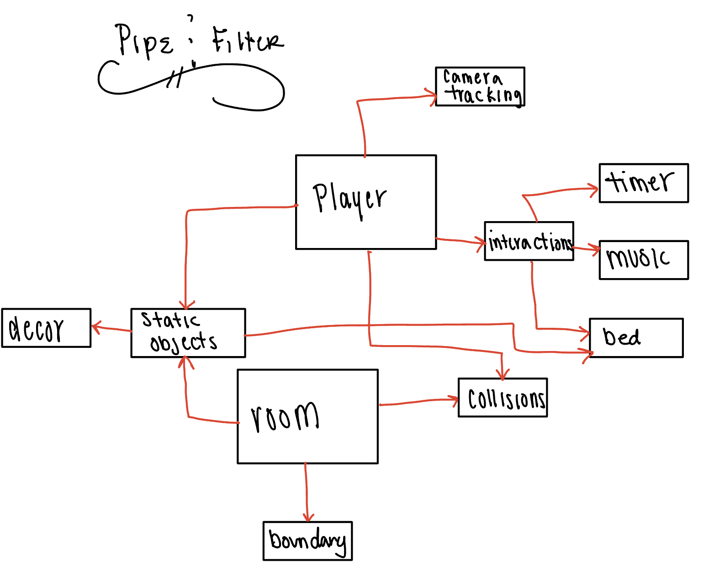

#Design Document 

[Back to home] (README.md)

##Design choosen: Pipe & Filter 
Pipe and filter fit the system best because of the smaller scope of the project. My project wasn't too complex as far as interactions between moving parts. The only moving part is the player while the room object are statics. The interaction between the moving pipe being the character movement interacts with the object in the room. The character you play is designed to have limited actions because we are keeping things distraction free. 

##Breaking it into Classes 

